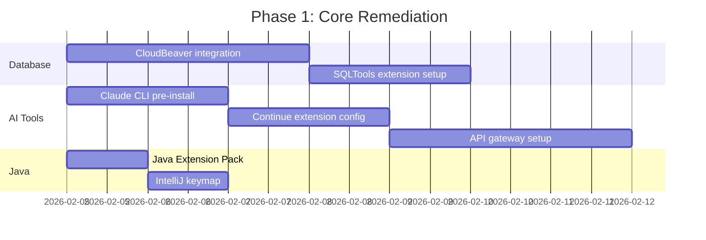
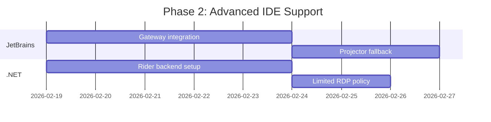

# Coder WebIDE - Developer Experience Limitations & Remediation Plan

## Executive Summary

Migrating developers from native IDEs (Visual Studio, IntelliJ, Toad SQL) and CLI tools (Claude CLI) to a browser-based environment will face significant pushback. This document analyzes each limitation and provides remediation strategies to maximize adoption.

## Limitation Analysis by Tool

### 1. Visual Studio (Full .NET IDE)

#### Developer Expectations
- Full .NET Framework and .NET Core development
- Windows Forms / WPF designers
- XAML visual editor
- NuGet package manager GUI
- Advanced debugging (memory profiling, IntelliTrace)
- Azure DevOps integration
- Local IIS Express for testing

#### Limitations in Web IDE

| Feature | VS Code Web | Impact | Severity |
|---------|-------------|--------|----------|
| Windows Forms Designer | Not available | Cannot design GUI visually | **Critical** |
| WPF/XAML Designer | Not available | No visual XAML editing | **Critical** |
| Full IntelliSense | Partial (via C# extension) | Slower, less accurate | High |
| .NET Profiler | Not available | Cannot profile memory/CPU | High |
| Local debugging | Limited | No Edit & Continue | Medium |
| Solution Explorer | Different UX | Learning curve | Low |

#### Pushback Scenarios
> "I can't design Windows Forms without the visual designer"
> "IntelliSense is slower and misses things"
> "I need the memory profiler to find leaks"

#### Remediation Strategies

| Strategy | Description | Effort | Effectiveness |
|----------|-------------|--------|---------------|
| **JetBrains Gateway** | Use JetBrains Rider backend remotely | Medium | High |
| **VS Code C# Dev Kit** | Install enhanced C# extension | Low | Medium |
| **Remote Desktop for Design** | Allow RDP only for designer work | Medium | High |
| **Blazor/MAUI Migration** | Migrate away from WinForms | High | Long-term |
| **Mock Designer** | Use Figma→Code for UI, code-first approach | Medium | Medium |

---

### 2. IntelliJ IDEA / JetBrains IDEs

#### Developer Expectations
- Advanced Java/Kotlin refactoring
- Database tools built-in
- Spring Boot integration
- Maven/Gradle deep integration
- Powerful search (Search Everywhere)
- Custom keybindings and workflows

#### Limitations in Web IDE

| Feature | VS Code Web | Impact | Severity |
|---------|-------------|--------|----------|
| Refactoring quality | Basic | Less safe refactors | High |
| Database browser | Extension-based | Different workflow | Medium |
| Spring integration | Partial | Less autocomplete | Medium |
| Performance | Slower | Noticeable lag | Medium |
| Keybindings | Different | Muscle memory loss | Medium |
| Local history | Not available | Risk of losing changes | High |

#### Pushback Scenarios
> "IntelliJ's refactoring is much safer and comprehensive"
> "I've used IntelliJ keybindings for 10 years"
> "The database tool in IntelliJ is better than any extension"

#### Remediation Strategies

| Strategy | Description | Effort | Effectiveness |
|----------|-------------|--------|---------------|
| **JetBrains Gateway + Coder** | Run IntelliJ backend in workspace | Medium | **Very High** |
| **IntelliJ Keymap Extension** | VS Code extension for keybindings | Low | Medium |
| **Projector (JetBrains)** | Browser-based IntelliJ | Medium | High |
| **Extension Pack** | Java Extension Pack + Spring Boot | Low | Medium |

**Recommended: JetBrains Gateway Integration**

```hcl
# Add to workspace template - main.tf
resource "coder_app" "intellij" {
  agent_id     = coder_agent.main.id
  slug         = "intellij"
  display_name = "IntelliJ IDEA"
  icon         = "/icon/intellij.svg"
  url          = "http://localhost:8887"
  subdomain    = true
}

# In Dockerfile, add JetBrains Projector
RUN curl -fsSL https://download.jetbrains.com/idea/ideaIC-2024.1.tar.gz | tar -xz -C /opt
```

---

### 3. Toad SQL / Database Management Tools

#### Developer Expectations
- Visual query builder
- Schema comparison
- Data export/import GUI
- Execution plan visualization
- Multiple database connections
- Stored procedure debugging

#### Limitations in Web IDE

| Feature | VS Code Web | Impact | Severity |
|---------|-------------|--------|----------|
| Visual query builder | Not available | Must write SQL manually | High |
| Schema diff | Limited | Extension-dependent | High |
| SP debugging | Not available | Cannot step through | **Critical** |
| Data grid editing | Basic | Less intuitive | Medium |
| Multi-DB support | Via extensions | Fragmented experience | Medium |

#### Pushback Scenarios
> "I need to visually compare schemas between environments"
> "Toad's execution plan viewer is essential for optimization"
> "I debug stored procedures daily - this is a blocker"

#### Remediation Strategies

| Strategy | Description | Effort | Effectiveness |
|----------|-------------|--------|---------------|
| **CloudBeaver** | Web-based DB tool in workspace | Low | High |
| **Database Proxy** | Secure access via Boundary/pgBouncer | Medium | High |
| **DBeaver in Projector** | Run DBeaver via JetBrains Projector | Medium | High |
| **Azure Data Studio Web** | Microsoft's web-based SQL tool | Low | Medium |
| **SQLTools Extension** | VS Code database extension | Low | Medium |

**Recommended: CloudBeaver Integration**

```yaml
# Add to docker-compose.yml
cloudbeaver:
  image: dbeaver/cloudbeaver:latest
  container_name: cloudbeaver
  ports:
    - "8978:8978"
  volumes:
    - cloudbeaver_data:/opt/cloudbeaver/workspace
  networks:
    - coder-network
```

```hcl
# Add to workspace template
resource "coder_app" "database" {
  agent_id     = coder_agent.main.id
  slug         = "database"
  display_name = "Database Tools"
  icon         = "/icon/database.svg"
  url          = "http://localhost:8978"
  subdomain    = true
}
```

---

### 4. Claude CLI / AI Coding Assistants

#### Developer Expectations
- AI-powered code completion
- Natural language to code
- Code explanation and review
- Terminal-based interaction
- Context-aware suggestions

#### Limitations in Web IDE

| Feature | VS Code Web | Impact | Severity |
|---------|-------------|--------|----------|
| Claude CLI access | Network restricted | Cannot reach API | **Critical** |
| API key security | Cannot store locally | Security concern | High |
| Extension support | May be blocked | Limited AI features | High |
| Context length | Same | No limitation | None |

#### Pushback Scenarios
> "Claude CLI is essential to my workflow - I use it constantly"
> "AI assistants make me 2x more productive"
> "I need to be able to ask questions about the codebase"

#### Remediation Strategies

| Strategy | Description | Effort | Effectiveness |
|----------|-------------|--------|---------------|
| **Pre-installed Claude CLI** | Include in workspace image | Low | **Very High** |
| **Continue Extension** | Open-source AI extension | Low | High |
| **Cody (Sourcegraph)** | AI assistant extension | Low | High |
| **GitHub Copilot** | If licensed, install extension | Low | High |
| **Self-hosted LLM** | Run Ollama in cluster | High | Medium |
| **API Gateway** | Proxy AI requests through approved endpoint | Medium | High |

**Recommended: Claude CLI + Continue Extension**

```dockerfile
# Add to workspace Dockerfile

# Install Claude CLI (Anthropic)
RUN curl -fsSL https://claude.ai/install.sh | sh

# Or install via npm if available
RUN npm install -g @anthropic-ai/claude-cli

# Pre-configure for workspace
ENV ANTHROPIC_API_KEY_FILE=/home/coder/.secrets/anthropic_key
```

```hcl
# Inject API key securely via Coder
resource "coder_env" "anthropic_api_key" {
  agent_id = coder_agent.main.id
  name     = "ANTHROPIC_API_KEY"
  value    = var.anthropic_api_key  # From Coder secrets
}
```

**For Continue Extension (VS Code):**
```json
// .vscode/settings.json in workspace
{
  "continue.enableTabAutocomplete": true,
  "continue.model": "claude-3-opus"
}
```

---

## Comprehensive Remediation Matrix

| Tool | Primary Remediation | Fallback | Timeline |
|------|---------------------|----------|----------|
| Visual Studio | JetBrains Gateway + Rider | Limited RDP for designers | Phase 2 |
| IntelliJ | JetBrains Gateway | Projector | Phase 1 |
| Toad SQL | CloudBeaver | Database proxy + SQLTools | Phase 1 |
| Claude CLI | Pre-installed + API gateway | Continue extension | Phase 1 |

---

## Developer Persona Impact Analysis

### Persona 1: .NET Developer (High Impact)

```
Impact Score: 8/10 (Significant workflow disruption)

Pain Points:
- No visual designers for WinForms/WPF
- Debugging experience degraded
- Missing profiling tools

Remediation Priority: HIGH
Timeline: Requires Phase 2 (JetBrains Gateway)
Interim: Allow limited RDP for designer work only
```

### Persona 2: Java/Spring Developer (Medium Impact)

```
Impact Score: 5/10 (Manageable with extensions)

Pain Points:
- Refactoring less comprehensive
- Different keybindings
- Spring Boot wizard missing

Remediation Priority: MEDIUM
Timeline: Phase 1 (JetBrains Gateway optional)
Interim: Java Extension Pack + keymap extensions
```

### Persona 3: Database Developer/DBA (High Impact)

```
Impact Score: 7/10 (Workflow significantly different)

Pain Points:
- No visual query builder
- Schema comparison tools missing
- Cannot debug stored procedures

Remediation Priority: HIGH
Timeline: Phase 1 (CloudBeaver integration)
Interim: SQLTools extension + CLI tools
```

### Persona 4: AI-Assisted Developer (Medium Impact)

```
Impact Score: 4/10 (Easily remediated)

Pain Points:
- Network access to AI APIs
- Extension installation

Remediation Priority: MEDIUM
Timeline: Phase 1 (Pre-install tools)
Interim: API gateway + pre-configured CLI
```

---

## Implementation Phases

### Phase 1: Core Remediation (Week 1-2)



### Phase 2: Advanced IDE Support (Week 3-4)



---

## Updated Workspace Template with Remediations

```hcl
# templates/contractor-workspace/main.tf (enhanced)

# Additional parameters for tool selection
data "coder_parameter" "ide_preference" {
  name         = "ide_preference"
  display_name = "IDE Preference"
  description  = "Select your preferred development environment"
  type         = "string"
  default      = "vscode"
  mutable      = false

  option {
    name  = "VS Code (Web)"
    value = "vscode"
  }
  option {
    name  = "IntelliJ IDEA (via Gateway)"
    value = "intellij"
  }
  option {
    name  = "JetBrains Rider (.NET)"
    value = "rider"
  }
}

data "coder_parameter" "enable_db_tools" {
  name         = "enable_db_tools"
  display_name = "Database Tools"
  description  = "Include CloudBeaver for database management"
  type         = "bool"
  default      = "true"
  mutable      = true
}

data "coder_parameter" "enable_ai_tools" {
  name         = "enable_ai_tools"
  display_name = "AI Coding Tools"
  description  = "Include Claude CLI and AI extensions"
  type         = "bool"
  default      = "true"
  mutable      = true
}
```

---

## Communication Strategy

### Addressing Pushback

| Objection | Response |
|-----------|----------|
| "This is slower than my local IDE" | "We're adding JetBrains Gateway support - same IDE, remote backend" |
| "I can't do my job without Toad" | "CloudBeaver provides 90% of features; we're adding it to workspaces" |
| "I need Claude CLI for productivity" | "It's pre-installed with secure API access" |
| "Visual Studio is required for .NET" | "Rider via Gateway is equivalent; designer work has RDP exception" |

### Training Plan

| Session | Audience | Duration | Topics |
|---------|----------|----------|--------|
| Intro to Web IDE | All | 1 hour | Basic navigation, extensions |
| Java Developer | Java devs | 2 hours | Extension pack, debugging, Gateway |
| .NET Developer | .NET devs | 2 hours | C# extensions, Rider, workarounds |
| Database Developer | DBAs | 2 hours | CloudBeaver, SQLTools, proxy |
| AI Tools Workshop | All | 1 hour | Claude CLI, Continue, best practices |

---

## Success Metrics

| Metric | Target | Measurement |
|--------|--------|-------------|
| Developer satisfaction | > 3.5/5 after 1 month | Survey |
| Feature parity perception | > 70% "adequate" | Survey |
| Productivity impact | < 15% decrease | Sprint velocity |
| Tool adoption | > 80% using recommended tools | Telemetry |
| Support tickets | < 5/week after month 1 | Helpdesk |

---

## Risk Register

| Risk | Likelihood | Impact | Mitigation |
|------|------------|--------|------------|
| .NET developers refuse adoption | High | High | RDP exception for designers |
| AI tools blocked by security | Medium | High | Pre-approved API gateway |
| JetBrains Gateway licensing cost | Medium | Medium | Budget approval in advance |
| Performance complaints | High | Medium | Resource tier options |
| Data loss concerns | Medium | High | Auto-save, git push reminders |

---

## Recommendations

### Must-Have (Phase 1)
1. **CloudBeaver** for database developers
2. **Claude CLI pre-installed** with API gateway
3. **Continue extension** configured
4. **SQLTools** for quick queries
5. **Java Extension Pack** with IntelliJ keymap

### Should-Have (Phase 2)
1. **JetBrains Gateway** integration
2. **Rider backend** for .NET developers
3. **Projector** as browser-based JetBrains fallback

### Nice-to-Have (Phase 3)
1. **Self-hosted LLM** (Ollama) for air-gapped environments
2. **Custom extension marketplace** with approved extensions
3. **Automated workspace templates** per project type

---

## Conclusion

The key to successful adoption is **not forcing 100% feature parity** but rather:

1. **Acknowledging limitations** openly
2. **Providing alternatives** that cover 80%+ of use cases
3. **Allowing exceptions** for truly blocked workflows (e.g., RDP for WinForms design)
4. **Iterating based on feedback** from pilot users

Most developer resistance can be overcome with JetBrains Gateway integration (same IDE, remote execution) and proper tooling for databases and AI assistants.
